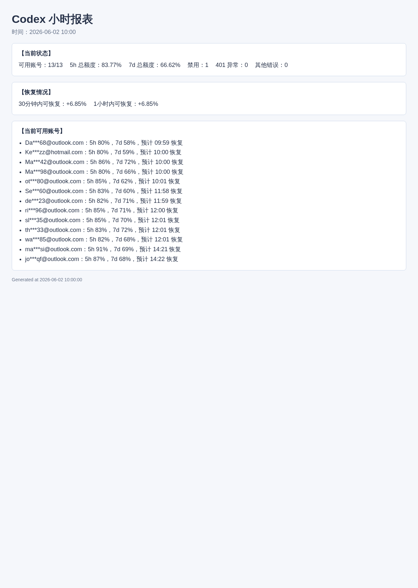
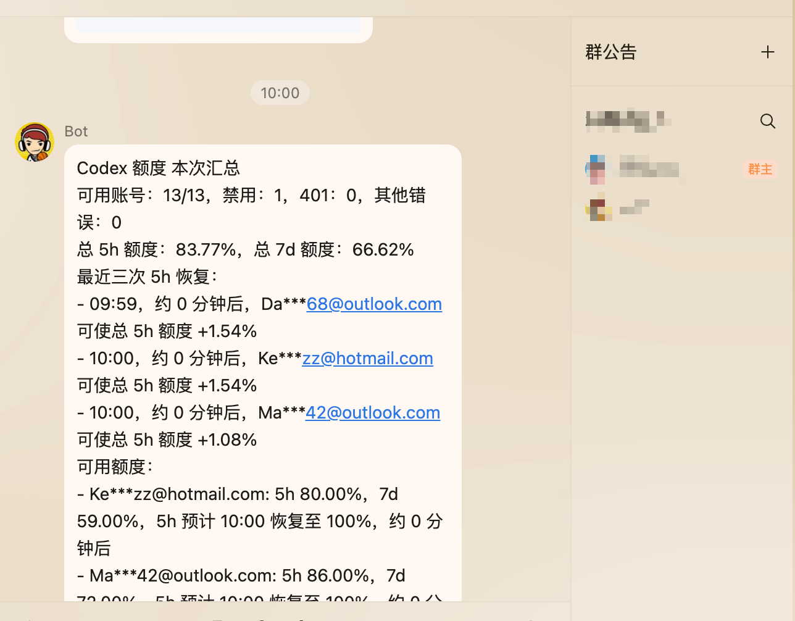

# Account Quota Monitor

Account Quota Monitor 是一个服务器常驻的账号额度监控服务。它按 Cron 定时请求 CPA / sub2 等管理端接口，将采集结果写入 SQLite，按阈值触发告警，生成图片报表，并通过 QQ OneBot 网关推送。

项目地址：[mafuchao99/account-quota-monitor](https://github.com/mafuchao99/account-quota-monitor)

English documentation: [README.en.md](README.en.md)

开发维护说明：

- [项目速览](docs/project-overview_CN.md)
- [CLIProxyAPI Codex 额度采集器开发说明](docs/cli-proxy-codex-collector_CN.md)

## 效果展示

小时报会渲染为本地图片，方便直接查看当前账号池状态、恢复情况和可用账号明细。



配置 OneBot/NapCatQQ 后，监控汇总会自动发送到 QQ 群或私聊。



## 项目结构

```text
src/cpa_monitor/
  domain/          # 纯业务模型与告警规则
  application/     # 用例编排、配置、端口协议、调度表达式
  infrastructure/  # HTTP、SQLite、OneBot、HTML/PNG 报表适配器
  interfaces/      # CLI 入口与依赖装配
```

这种分层让核心业务不绑定具体外部实现：后续加飞书、企业微信、PostgreSQL、Web 管理台或新的采集方式时，优先新增 infrastructure 适配器，而不是改业务规则。

## 3 分钟快速启动

```bash
python scripts/dev.py setup
```

如果使用 CLIProxyAPI / CPA，把 `.env` 里的占位值换成你的 CLIProxyAPI 地址和 Management Key：

```env
CPA_ENDPOINT=https://your-domain.example
CPA_MANAGEMENT_KEY=your-management-key
```

如果使用 sub2 监控，把 `config.yaml` 里 `sub2-codex-quota.enabled` 改为 `true`，并配置：

```env
SUB2_ENDPOINT=https://your-sub2-domain.example
SUB2_ADMIN_API_KEY=admin-api-key
```

运行一次采集验证。`collect` 只会采集当前启用的 target；如果只启用了 sub2，就只会请求 sub2 账号列表：

```bash
python scripts/dev.py collect
```

`credentials` / `quota-one` 只适用于 `cli_proxy_codex` 目标。sub2 监控通过 `collect` / `run` 调用账号列表接口。

## Docker 部署

1. 复制配置：

```bash
cp .env.example .env
cp config.example.yaml config.yaml
```

2. 修改 `.env` 和 `config.yaml`：

- 如果使用 CPA：`.env` 里的 `CPA_ENDPOINT` 填写 CLIProxyAPI 地址，`CPA_MANAGEMENT_KEY` 填写 Management Key。
- 如果使用 sub2：`.env` 里的 `SUB2_ENDPOINT` 填写 sub2 地址，`SUB2_ADMIN_API_KEY` 填写 Admin API Key。
- `targets[].collector`：CPA 使用 `cli_proxy_codex`；sub2 使用 `sub2_codex`，它只读取账号列表里的本地 Codex 快照。
- `targets[].enabled`：目标级开关。需要从 CPA 切到 sub2 时，可以关闭 CPA 目标，打开 `sub2-codex-quota`。
- `targets[].base_url`：默认使用环境变量，不要把真实接口地址提交到仓库。
- `targets[].headers.Authorization` / `targets[].headers.x-api-key`：真实 Key 写到本地 `.env` 或运行环境变量，不要提交到仓库。
- `targets[].delay_min_seconds` / `delay_max_seconds`：全量采集时每个凭证顺序查询，两个凭证之间随机等待，默认 5 到 10 秒，避免并发触发风控。
- `notifications.console.enabled`：默认开启，告警和报表提醒会直接打印到控制台。
- `notifications.onebot.enabled`：如果使用 NapCatQQ/OneBot，改为 `true`，再填写 endpoint 和接收人；当前只有 OneBot/NapCatQQ 通道可以发送 QQ 通知。
- `notifications.qqbot.enabled`：QQ 官方机器人通道暂未适配，请先保持 `false`。

3. 启动：

```bash
docker compose up -d --build
```

4. 查看日志：

```bash
docker compose logs -f cpa-monitor
```

默认容器会把配置挂载到 `/app/config/config.yaml`，数据和报表写入宿主机 `./data`。
镜像内部使用 `uv` 按 `uv.lock` 安装依赖，保证本地和容器里的依赖解析一致。

远程服务器重新构建代码：

```bash
cd /path/to/account-quota-monitor
git pull
docker compose down
docker compose up -d --build
docker compose logs -f cpa-monitor
```

如果你的远程仓库地址还是旧项目名，可以先更新 remote：

```bash
git remote set-url origin https://github.com/mafuchao99/account-quota-monitor.git
```

## 本地开发

首次初始化：

```bash
python scripts/dev.py setup
```

这个命令内部会执行 `uv sync`、`uv run playwright install chromium`，并在缺少 `config.yaml` 或 `.env` 时从示例配置复制一份。

日常运行：

```bash
python scripts/dev.py run
```

更多本地命令见下方“常用命令”。

macOS/Linux 如果安装了 `make`，也可以使用快捷命令：

```bash
make setup
make run
```

Windows PowerShell 同样使用 Python 脚本：

```powershell
python scripts/dev.py setup
python scripts/dev.py run
```

## 常用命令

本地开发优先使用 `scripts/dev.py`，它会自动带上 `--config config.yaml`：

| 命令 | 用途 | 是否请求远程接口 |
| --- | --- | --- |
| `python scripts/dev.py setup` | 安装依赖、安装 Playwright Chromium，并在缺少本地配置时复制示例文件。 | 否 |
| `python scripts/dev.py run` | 启动常驻监控调度；会按配置定时采集、生成小时报、发送通知。 | 是，按启用的 target 请求 |
| `python scripts/dev.py collect` | 立即执行一次采集并写入 SQLite；sub2 只读取账号列表快照。 | 是 |
| `python scripts/dev.py credentials` | 读取 CLIProxyAPI 管理端凭证列表，查看 active、disabled、unavailable、auth_index 等状态。 | 是，只请求管理端凭证列表 |
| `python scripts/dev.py quota-one --match gmail` | 只查询一个匹配的凭证，适合排查单个账号额度或 401。 | 是，只查一个凭证 |
| `python scripts/dev.py report` | 生成并发送小时报；只读取本地 SQLite 最近 `app.report_hours` 的快照。 | 否 |
| `python scripts/dev.py report --hours 6 --detail-mode all` | 手动查看 6 小时额度汇总/完整报；不受 `full_report_enabled` 影响。 | 否 |
| `python scripts/dev.py notify --message "Account Quota Monitor 通知测试"` | 发送一条测试通知，用于验证控制台或 OneBot/NapCatQQ 配置。 | 否 |
| `python scripts/dev.py onebot-login` | 调用 OneBot `/get_login_info`，验证 NapCat 是否可访问。 | 否 |
| `python scripts/dev.py onebot-groups` | 调用 OneBot `/get_group_list`，查看机器人加入的群。 | 否 |
| `python scripts/dev.py test` | 运行测试。 | 否 |
| `python scripts/dev.py clean` | 删除本地测试和构建缓存。 | 否 |

也可以直接调用 CLI，适合部署脚本或临时调试：

```bash
uv run cpa-monitor --config config.yaml run
uv run cpa-monitor --config config.yaml collect-once
uv run cpa-monitor --config config.yaml credentials
uv run cpa-monitor --config config.yaml quota-one --match gmail
uv run cpa-monitor --config config.yaml report
uv run cpa-monitor --config config.yaml report --hours 6 --detail-mode all
uv run cpa-monitor --config config.yaml notify-test --message "Account Quota Monitor 通知测试"
```

注意：`report` 只读本地数据库并生成报表，不会请求远程接口；`collect`、`run` 会访问当前启用的 target，`credentials`、`quota-one` 只适用于 CPA / CLIProxyAPI。

## 配置说明

`config.example.yaml` 是可运行模板，核心字段如下：

- `app.timezone`：调度和报表时区。
- `app.database_url`：SQLite 路径，当前第一版只支持 `sqlite:///...`。
- `app.report_dir`：HTML/PNG 报表输出目录。
- `app.report_cron` / `app.report_crons` / `app.report_hours` / `app.report_detail_mode`：小时报 Cron、统计窗口和分时明细模式；`report_crons` 支持多个定制发送时间，旧字段 `report_cron` 仍兼容。默认每小时发送最近 1 小时，只展示最新一次明细。
- `app.full_report_enabled` / `app.full_report_crons` / `app.full_report_hours` / `app.full_report_detail_mode`：完整报开关、Cron 列表、统计窗口和分时明细模式；默认关闭，开启后按 07:30、12:10、19:10、23:30 发送最近 6 小时完整明细，只做数据总结，不触发采集。
- 401 账号分析会按邮箱和日期去重；同一天已报告过的 401 账号，后续小时报/完整报不再重复展示，第二天重新统计新的 401。
- `targets[].enabled`：目标开关，默认 `true`；设为 `false` 后不会被调度，也不会被 `collect-once` 采集。
- `targets[].collector`：采集器类型。`cli_proxy_codex` 会调用 CLIProxyAPI 的 `/auth-files` 和 `/api-call`；`sub2_codex` 会调用 sub2 `/api/v1/admin/accounts` 读取本地 `extra.codex_*` 快照；不配置时兼容原来的 `http_json`。
- `targets[].base_url`：CLIProxyAPI 地址。示例使用环境变量 `CPA_ENDPOINT`，真实地址写到本地 `.env` 或运行环境变量。
- `targets[].headers.Authorization`：请求鉴权头，格式为 `Bearer <Management Key>`；示例使用环境变量 `CPA_MANAGEMENT_KEY`，真实 Key 写到本地 `.env` 或运行环境变量。
- `sub2_codex` 使用 `headers.x-api-key` 配置 Admin API Key。它不会调用 `/usage` 主动查询上游，只分页读取账号列表里的 Codex 快照字段；快照来自 sub2 本地保存的最近使用结果，可能不是实时余量。
- sub2 小时报会识别 `rate_limit_reset_at`、`temp_unschedulable_until`、`overload_until` 等 429/临时不可调度字段。429 账号会显示在“异常账号”里，并按预计恢复时间排序。
- sub2 小时报会展示 `extra.codex_usage_updated_at` 快照更新时间，方便判断余量数据是否足够新。
- 小时报顶部的“5h 总额度 / 7d 总额度”只按当前可用账号计算；429、401、错误、额度耗尽和不可用账号不会参与这个平均值。
- `targets[].delay_min_seconds` / `delay_max_seconds`：全量额度采集的随机间隔。只影响 `collect` / 常驻采集，`quota-one` 单查不会等待。
- `targets[].cron` / `targets[].crons`：单个接口采集 Cron；简单场景用 `cron`，复杂时段用 `crons` 列表。建议采集时间早于报告时间，默认示例在第 50 分钟采集，给整点小时报留出采集窗口。
- `targets[].dynamic_schedule`：可选动态采集频率，默认关闭；开启后采集不再使用 `cron`，正常按 `normal_interval_minutes`，剩余比例低于 `urgent_remaining_percent` 时按 `urgent_interval_minutes`，未配置紧张阈值时沿用 `thresholds.remaining_percent`。
- `targets[].json_paths`：仅 `http_json` 采集器需要，用于从响应 JSON 中提取总量、可用量、错误数和类型明细。
- `targets[].thresholds`：可用量下降、401、其他错误、剩余比例和静默时间阈值。
- `notifications.console`：控制台通知配置，默认开启，适合本地调试和不接机器人时使用。
- `notifications.onebot`：NapCatQQ/OneBot 通知配置。支持群消息、私聊、登录信息探测、群列表探测；报表图片先尝试本地 `file://`，网关读不到路径时自动使用 `base64://` 兜底。
- `notifications.qqbot`：QQ 官方机器人预留配置，当前暂未适配发送能力，请保持关闭。

## 开源数据边界

仓库只提交代码、文档、测试、`.env.example` 和 `config.example.yaml`。真实运行数据全部保留在本地，不应提交：

- `.env`：真实 CPA 地址、Management Key、机器人密钥。
- `config.yaml`：本机运行配置，可能包含私有开关或路径。
- `data/monitor.db`：SQLite 数据库，包含账号状态、额度快照、401 记录。
- `data/reports/`：生成的 HTML/PNG 报告，可能包含邮箱和额度数据。

数据库表结构由程序启动时自动创建和迁移，不需要提交空数据库；其他人拉取项目后复制示例配置并运行即可生成自己的本地数据。

## 架构职责

- `application`：读取配置、编排采集/告警/报表用例，并封装 APScheduler 调度策略。
- `domain`：保存监控快照、类型指标和告警规则，不依赖 HTTP、SQLite、QQ 或浏览器。
- `infrastructure/http`：使用 `httpx` 请求目标 HTTP JSON 接口。
- `infrastructure/storage`：使用 SQLite 保存历史快照和告警静默状态。
- `infrastructure/reporting`：先生成 HTML 报表，再用 Playwright/Chromium 截图为 PNG。
- `infrastructure/notify`：调用 OneBot HTTP API 推送通知；QQ 官方 Bot 通道暂未适配。

## QQ 通知

项目默认开启控制台通知，不配置机器人也可以看到监控输出。当前 QQ 推送只支持 NapCatQQ/OneBot 11 网关，QQ 官方机器人通道暂未适配，请不要开启 `notifications.qqbot.enabled`。

如果你使用 NapCatQQ/OneBot 11 网关，在 `config.yaml` 中启用 OneBot 并填写 endpoint、token 和接收人：

```yaml
notifications:
  onebot:
    enabled: true
    endpoint: http://127.0.0.1:3000
    access_token: your-onebot-token
    group_ids:
      - 123456789
```

配置完成后可以先发一条测试通知：

```bash
python scripts/dev.py notify --message "Account Quota Monitor 通知测试"
```

Account Quota Monitor 使用这些 OneBot HTTP API：

- 连通性测试：`/get_login_info`
- 获取群列表：`/get_group_list`
- 群消息：`/send_group_msg`
- 私聊：`/send_private_msg`
- 通用发送：`/send_msg`

可以先用配置里的 endpoint/token 测 NapCat 是否可访问：

```bash
python scripts/dev.py onebot-login
python scripts/dev.py onebot-groups
```

文本和图片都使用 OneBot Array 消息段格式；报表图片会先以 `file://` 本地路径发送。如果 OneBot 网关运行在 Docker 外部或另一台机器上，读不到容器内报表路径时会自动改用 `base64://` 图片兜底。后续要接入更多 NapCat/OneBot 动作时，优先在 `OneBotClient.call()` 上薄封装一个方法。
