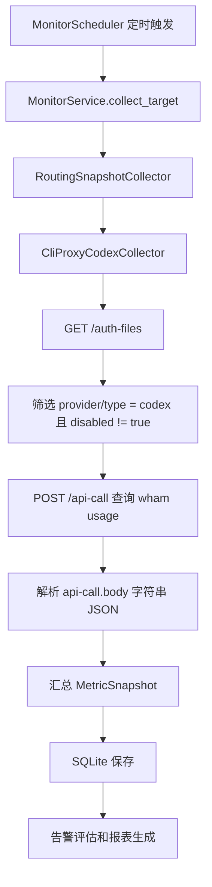

# CLIProxyAPI Codex 额度采集器开发说明

本文档面向 CPA Monitor 的维护者和二次开发者，说明项目如何接入 CLIProxyAPI 管理端来采集 Codex 额度。这里不重复完整接口文档，只记录本项目的架构决策、数据流和扩展边界。

## 设计目标

CPA Monitor 的核心目标是把“外部额度来源”转换成统一的 `MetricSnapshot`，后续的存储、告警、报表和通知都只依赖这个领域模型。

CLIProxyAPI 的 Codex 额度不是单个普通 JSON 接口，而是一个两步流程：

1. 调用管理端 `GET /v0/management/auth-files` 获取凭证列表。
2. 对每个 Codex 凭证调用 `POST /v0/management/api-call`，由 CLIProxyAPI 代理请求 `https://chatgpt.com/backend-api/wham/usage`。

因此本项目没有把它硬塞进 `json_paths`，而是新增 `cli_proxy_codex` 采集器。原来的 `http_json` 采集器继续保留，用于监控普通 HTTP JSON 接口。

## 配置约定

公开仓库只提交模板，不提交真实地址和 Management Key：

```env
CPA_ENDPOINT=https://your-cpa-endpoint.example.com
CPA_MANAGEMENT_KEY=your-management-key
```

```yaml
targets:
  - id: codex-quota
    name: Codex 额度
    collector: cli_proxy_codex
    base_url: ${CPA_ENDPOINT}
    headers:
      Authorization: "Bearer ${CPA_MANAGEMENT_KEY}"
```

`CPA_ENDPOINT` 可以填写裸域名，也可以填写完整管理端地址：

- `https://example.com`
- `https://example.com/v0/management`

采集器内部会统一规范为 `/v0/management`。真实 `.env` 和 `config.yaml` 已被 `.gitignore` 忽略，避免开源上传时泄露私有部署信息。

## 架构分层

项目保持端口与适配器风格：

- `domain`：定义 `MetricSnapshot`、`TypeMetric` 和告警规则，不关心 HTTP、SQLite、QQ 或 CLIProxyAPI。
- `application`：读取配置、调度采集、评估告警、生成报表任务。它只依赖 `SnapshotCollector` 端口。
- `infrastructure/http`：实现具体采集器，包括通用 `http_json` 和 CLIProxyAPI 专用 `cli_proxy_codex`。
- `interfaces`：装配依赖，当前通过 `RoutingSnapshotCollector` 根据 `targets[].collector` 选择采集器。

新增采集来源时，优先新增 infrastructure 适配器，并让它输出 `MetricSnapshot`。除非领域模型确实表达不了新的业务含义，否则不要把外部接口细节向 `domain` 或 `application` 扩散。

## CLIProxyAPI 数据流

`cli_proxy_codex` 采集流程如下：



`/api-call` 返回里的 `body` 是字符串，不是对象。采集器必须二次 `JSON.parse`，再读取 `rate_limit`。

## 快照映射规则

采集器把 CLIProxyAPI 结果压成现有监控模型：

| `MetricSnapshot` 字段 | 来源与含义 |
| --- | --- |
| `total` | 未禁用的 Codex 凭证数量 |
| `available` | usage 返回 `allowed == true` 且 `limit_reached != true` 的凭证数量 |
| `disabled` | 管理端返回的 disabled Codex 凭证数量 |
| `unauthorized` | `/api-call` 内部 `status_code` 为 401 或 403 的数量 |
| `other_errors` | 缺少 `auth_index`、请求失败、非 2xx/非鉴权错误、body 解析失败等数量 |
| `type_metrics` | 每个凭证一条账号明细 |

`TypeMetric.type_name` 优先使用 `label`，其次是 `email`、`name`、`auth_index`、`id`。5 小时和 7 天剩余百分比使用 `100 - used_percent` 计算：

- `rate_limit.primary_window.used_percent` -> `remaining_5h_percent`
- `rate_limit.secondary_window.used_percent` -> `remaining_7d_percent`

## 错误处理策略

采集器用于长期运行的监控服务，所以尽量把失败转换成快照，而不是让定时任务直接中断：

- `/auth-files` 整体失败：返回 `other_errors = 1` 的错误快照。
- 单个凭证缺少 `auth_index`：该凭证记为 `other_errors = 1`。
- 单个 `/api-call` 请求失败或 body 解析失败：该凭证记为 `other_errors = 1`。
- `/api-call` 内部 `status_code` 为 401/403：该凭证记为 `unauthorized = 1`。

这样 SQLite 里仍然能看到失败记录，告警规则也能按阈值推送。

## 扩展建议

如果后续要支持新的来源，例如 OpenAI Key、其他代理服务或企业内部额度接口，建议按下面方式扩展：

1. 在 `TargetConfig.collector` 增加新的采集器名称。
2. 在 `infrastructure/http` 或新的 infrastructure 子目录实现适配器。
3. 在 `RoutingSnapshotCollector` 里注册路由。
4. 添加针对映射规则和错误处理的单元测试。
5. 只在 `config.example.yaml` 暴露必要配置，敏感值继续通过 `.env.example` 占位。

不要为了某个外部接口把 `MetricSnapshot` 改成接口响应的镜像结构。领域模型应该保持稳定，外部响应字段只在采集器内消化。

## 相关测试

维护采集器时至少关注这些测试：

- `tests/test_cli_proxy_codex.py`：CLIProxyAPI 映射、鉴权错误、`api-call` 请求体和 URL 规范化。
- `tests/test_scheduler.py`：`.env` 加载和配置解析。
- `tests/test_collector.py`：通用 `http_json` 兼容逻辑。

修改采集器后运行：

```bash
uv run pytest
```
