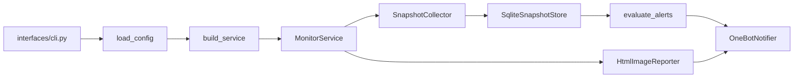

# CPA Monitor 项目速览

记录日期：2026-06-01

## 一句话理解

CPA Monitor 是一个常驻运行的 Python 额度监控服务。它按配置定时采集目标接口或 CLIProxyAPI Codex 凭证额度，保存 SQLite 历史快照，根据阈值触发 OneBot 通知，并可生成 HTML/PNG 汇总报表。

## 核心运行链路



主要入口：

- `cpa-monitor --config config.yaml run`：启动 APScheduler 常驻调度。
- `cpa-monitor --config config.yaml collect-once`：对所有 targets 采集一次并评估告警。
- `cpa-monitor --config config.yaml report --hours 3`：读取最近快照生成报表并推送。

## 分层职责

- `src/cpa_monitor/domain/`：纯业务模型与告警规则。这里不依赖 HTTP、SQLite、OneBot 或 Playwright。
- `src/cpa_monitor/application/`：配置模型、端口协议、服务编排、Cron/动态调度逻辑。
- `src/cpa_monitor/infrastructure/`：外部适配器，包括 HTTP 采集、CLIProxyAPI Codex 采集、SQLite、OneBot、HTML/PNG 报表。
- `src/cpa_monitor/interfaces/`：命令行入口与依赖装配。
- `scripts/dev.py`：本地开发助手，封装 setup、run、collect、report、test、clean。

## 关键模块笔记

### 配置加载

文件：`src/cpa_monitor/application/config.py`

- 支持 YAML 和 TOML。
- 会自动读取配置文件同目录的 `.env`，再展开 `${ENV_NAME}` 和 `${ENV_NAME:-default}`。
- `TargetConfig.collector` 默认是 `http_json`，示例配置使用 `cli_proxy_codex`。
- 对 `cli_proxy_codex` 有占位值校验，避免用示例 endpoint 或 Management Key 启动。
- 小时报支持 `report_crons` 多 Cron 列表；旧字段 `report_cron` 仍兼容。
- 采集任务支持 `targets[].crons` 多 Cron 列表；旧字段 `targets[].cron` 仍兼容。
- `dynamic_schedule` 支持根据剩余比例在普通间隔和紧急间隔之间切换。

### 服务编排

文件：`src/cpa_monitor/application/service.py`

- `collect_target` 是采集的中心路径：取上一次快照、采集当前快照、保存、评估告警、发送通知。
- `send_report` 从存储层读取最近 N 小时快照，生成报表图片后通知。
- `run` 创建 `MonitorScheduler`，注册采集任务和报表任务后等待。

### 调度逻辑

文件：`src/cpa_monitor/application/schedule.py`

- `cron_kwargs` 支持 5 字段和 6 字段 Cron。
- 固定采集使用 CronTrigger。
- 小时报和固定采集都支持多个 Cron，适合按不同时段定制频率。
- 开启 `dynamic_schedule.enabled` 后，采集使用 IntervalTrigger，并在每次采集后根据剩余比例重排间隔。

### 采集器

文件：

- `src/cpa_monitor/infrastructure/http/collector.py`
- `src/cpa_monitor/infrastructure/http/cli_proxy_codex.py`
- `src/cpa_monitor/infrastructure/http/routing.py`

`http_json` 采集器按配置的 `url/method/headers/body/json_paths` 请求并解析通用 JSON。

`cli_proxy_codex` 采集器会：

1. 规范化管理端地址到 `/v0/management`。
2. 请求 `/auth-files`，筛选 provider/type 为 `codex` 且未禁用的凭证。
3. 顺序调用 `/api-call` 转发到 `https://chatgpt.com/backend-api/wham/usage`，凭证之间按配置随机等待，避免并发触发风控。
4. 将每个凭证映射为 `TypeMetric`，汇总 available、total、disabled、401 和其他错误。

### 告警

文件：`src/cpa_monitor/domain/alerts.py`

当前规则：

- 可用数量下降达到 `available_drop`。
- 401 数量达到 `unauthorized`。
- 其他错误数量达到 `other_errors`。
- 可用比例低于 `remaining_percent`。

静默状态通过 `SnapshotStore.should_send_alert` 和 `mark_alert_sent` 保存，目前 SQLite 表是 `alert_state`。

### 存储

文件：`src/cpa_monitor/infrastructure/storage/sqlite.py`

当前只支持 `sqlite:///...`。初始化时自动建表：

- `snapshots`：一次目标采集的总览数据和 raw JSON。
- `type_metrics`：每个 snapshot 下的细分账号或类型指标。
- `alert_state`：告警静默状态。
- `unauthorized_report_state`：按“账号名 + 日期”记录已展示过的 401 账号，避免同一天重复出现在小时报/完整报里。

### 报表

文件：`src/cpa_monitor/infrastructure/reporting/html.py`

- 先写 HTML 到 `app.report_dir`。
- 如果安装了 Playwright，则用 Chromium 截全页 PNG。
- 如果 Playwright 不可用，返回 `image_path=None`，服务层会发送一条文本提示。

### 通知

文件：`src/cpa_monitor/infrastructure/notify/onebot.py`

- `OneBotClient` 负责鉴权、重试和动作调用，已封装 `/get_login_info`、`/get_group_list`、`/send_group_msg`、`/send_private_msg`、`/send_msg`。
- `OneBotNotifier` 负责把文本告警和图片报表组装为 OneBot Array 消息段并广播到配置的群/私聊。
- 图片优先使用本地 `file://` URI；如果 OneBot 网关读不到该路径，会自动改用 `base64://` 图片兜底。

## 配置与部署

常用文件：

- `config.example.yaml`：主配置模板。
- `.env.example`：环境变量模板。
- `docker-compose.yml`：生产式容器运行。
- `docker-compose.dev.yml`：开发容器和测试 profile。
- `Dockerfile`：基于 Playwright Python 镜像，使用 uv 和 uv.lock 固定依赖。

本地常用命令：

```bash
python scripts/dev.py setup
python scripts/dev.py collect
python scripts/dev.py report
python scripts/dev.py test
```

直接运行包命令：

```bash
uv run cpa-monitor --config config.yaml collect-once
uv run cpa-monitor --config config.yaml report --hours 3
uv run cpa-monitor --config config.yaml run
```

## 测试覆盖现状

测试位于 `tests/`：

- `test_cli_proxy_codex.py`：管理端 URL 规范化、额度结果映射、api-call 请求结构、缺失 auth_index 错误。
- `test_scheduler.py`：Cron 解析、配置加载、`.env` 展开、占位配置拒绝、动态调度间隔选择。
- `test_onebot_notifier.py`：OneBot API 动作封装、群/私聊广播、图片 `file://` 和 `base64://` 兜底。
- `test_jsonpath.py`：简单 JSONPath 的嵌套字段和数组索引。
- `test_alerts.py`：可用量下降告警和静默去重。
- `test_collector.py`：通用 HTTP JSON 采集结果解析。
- `test_storage.py`：SQLite 快照、type metrics 和 401 展示状态保存。

## 后续修改入口

- 新增通知渠道：优先在 `infrastructure/notify/` 新增适配器，并扩展 `interfaces/bootstrap.py` 装配。
- 新增采集器：在 `infrastructure/http/` 或新的 infrastructure 子目录实现 `SnapshotCollector` 协议，再接入 `RoutingSnapshotCollector`。
- 新增存储后端：实现 `SnapshotStore` 协议，替换 bootstrap 中的 `SqliteSnapshotStore`。
- 新增告警规则：优先改 `domain/alerts.py`，并补对应单元测试。
- 调整报表样式或内容：改 `infrastructure/reporting/html.py`，注意 Playwright 只在依赖可用时生成 PNG。

## 观察到的注意点

- `SqliteSnapshotStore` 持有单个 sqlite 连接，当前用法适合单进程服务。
- `snapshots_since` 按所有 target 汇总读取，报表目前没有按 target 分组展示。
- `cli_proxy_codex` 的外部接口结构与 CLIProxyAPI 管理端强相关，接口字段变化时优先看 `tests/test_cli_proxy_codex.py`。
- 项目目前主要是服务端后台工具，没有 Web 管理界面。
